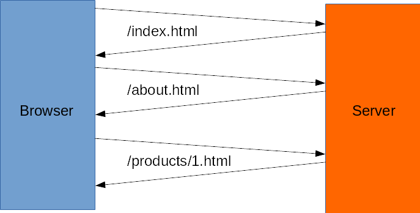
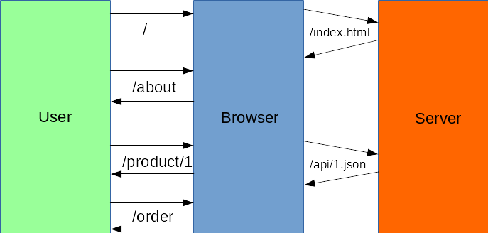

<!-- $size: 16:9 -->

## Angular Training
# Jumpstart

Peter Bouda, hey@peterbouda.eu

---

# Why Angular?

> building a community, building a place that a lot
of people can learn and become better developers.

Brad Green, Google engineering director of Angular

---

# Why Angular?

* Native mobile apps with web technologies (NativeScript)
	* Cross-platform development
* Server-side rendering (Angular Universal)
* Progressive web applications
* TypeScript
* RxJS, Observables and functional reactive programming
* Angular CLI

## It's a platform!

---

# Old-school web applications

---

# Single-page Applications

---

# Angular SPA

* The app is loaded once at first call of URL
* Angular catches all user interactions and events
* Angular router processes events and read and sets the URL
* Angular updates the DOM
* There is no interaction with the server
* The app will only send data programmatically, for example to an API

---

# The first app

Install Node.js! Then:

	$ npm install -g @angular/cli
    $ ng new workshop-app
    $ cd workshop-app
    $ ng serve
    
Goto http://localhost:4200

:+1:

&nbsp;
&nbsp;
&nbsp;

---

# Links

* Download these slides: https://github.com/ng-lisbon/workshop-1day-app
* Node.js: https://nodejs.org/en/
* Angular: https://angular.io/