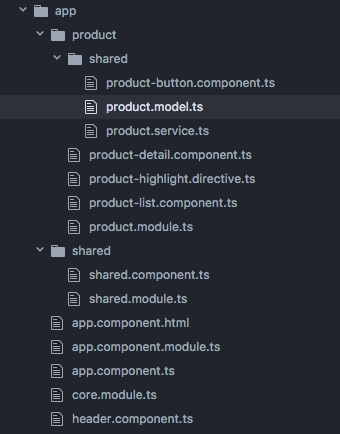

<!-- $size: 16:9 -->


## Angular Training
# Modules

Peter Bouda, hey@peterbouda.eu

---


# What are Modules?

* A collection of components, directives, services, ...
* Better code organization
* Routing via modules allows lazy loading of bundles
* Root Module vs. Feature Module
* Best practices: Core Module and Shared Module

---

# Module Definition

```
import { NgModule } from '@angular/core';
@NgModule({
  imports: [ ... ],
  declarations: [ ... ],
  bootstrap: [ ... ]
})
export class AppModule { }
```

---


# Module Hierarchy




---

# Root Module

```
import { BrowserModule } from '@angular/platform-browser';
import { NgModule } from '@angular/core';

import { AppComponent } from './app.component';
/* Mehr Components */

@NgModule({
  declarations: [
    AppComponent,
    /* Mehr Components */
  ],
  imports: [
    BrowserModule
],
  providers: [
  ],
  bootstrap: [AppComponent]
})
export class AppModule { }
```

---

# Feature Module

```
import { NgModule } from '@angular/core';
import { CommonModule } from '@angular/common';
import { FormsModule } from '@angular/forms';

import { FeatureComponent } from './feature.component';

@NgModule({
  declarations: [
    FeatureComponent
  ],
  imports: [
    FormsModule,
    CommonModule
  ]
})
export class FeatureModule {}
```

---

# Lazy Loading


* Lazy loading of bundles based on router, modules and webpack
* CLI creates bundles automatically and the app loads those based on the URL
* You need to use `loadChildren` to load the routes of the module

---

# Lazy Loading: Root Module

```
import { NgModule } from '@angular/core';
import { BrowserModule } from '@angular/platform-browser';
import { AppComponent } from './app.component';
import { EagerComponent } from './product.component';
import { routing } from './app.routing';
@NgModule({
  imports: [
    BrowserModule,
    routing
  ],
  declarations: [
    AppComponent,
    ProductComponent
  ],
  bootstrap: [AppComponent]
})
export class AppModule {}
```

---

# Lazy Loading: Root Router

```
import { ModuleWithProviders } from '@angular/core';
import { Routes, RouterModule } from '@angular/router';
import { ProductComponent } from './product.component';
const routes: Routes = [
  { path: '', redirectTo: 'product', pathMatch: 'full' },
  { path: 'product', component: ProductComponent },
  { path: 'shop', loadChildren: 'shop/shop.module#ShopModule' }
];
export const routing: ModuleWithProviders = RouterModule.forRoot(routes);
```

---

# Lazy Loading: Feature Module

```
import { NgModule } from '@angular/core';
import { ShopComponent } from './shop.component';
import { routing } from './shop.routing';
@NgModule({
  imports: [routing],
  declarations: [ShopComponent]
})
export class ShopModule {}
```

---

# Lazy Loading: Feature Router

```
import { ModuleWithProviders } from '@angular/core';
import { Routes, RouterModule } from '@angular/router';
import { ShopComponent } from './shop.component';
const routes: Routes = [
	{ path: '', component: ShopComponent }
];
export const routing: ModuleWithProviders = RouterModule.forChild(routes);
```

---


# Lazy Loading and Dependency Injection


* Anngular creates a new branch in the Dependency Injection Tree for each lazy loaded module
* Providers in such modules are only available as singletons in their branch
* So Angular will create a singleton for each service in each branch
* To create global singletons you need to export them as `forRoot`<br>in your module

---

# Share the DI Tree

```
import { NgModule, ModuleWithProviders } from '@angular/core';
import { ProductService } from './product.service';
@NgModule({})
export class SharedModule {
  static forRoot(): ModuleWithProviders {
    return {
      ngModule: SharedModule,
      providers: [ProductService]
    };
  }
}
```

---

# Share the DI Tree: Root Module

```
...
import { SharedModule } from './shared/shared.module';
@NgModule({
  imports: [
    SharedModule.forRoot(),
    ...
  ],
  ...
})
export class AppModule {}
```
